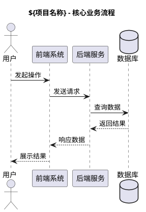

# PRD 生成器

本 skill 用于生成完整的产品需求文档（PRD）交付物，包含文档、流程图、UI 规范等。

## 工作流程

### 步骤 1：收集需求信息

向用户确认以下信息（如未提供则主动询问）：

| 信息项 | 说明 |
|--------|------|
| 项目/需求名称 | 用于创建输出目录 `docs/${项目名称}/产品设计/` |
| 需求来源 | 用户提供的需求描述、会议纪要、或现有文档 |
| 目标用户 | 谁会使用这个产品 |
| 核心功能 | 产品的主要功能模块 |
| 业务场景 | 使用场景和业务流程 |
| 非功能需求 | 性能、安全、兼容性等要求 |

**交互方式**：
- 如果用户提供的是口头描述，先整理出结构化的需求摘要，让用户确认
- 如果用户提供的是现有文档（如 .pptx、.docx、.md），读取内容后提取关键信息并确认
- 只有在用户确认需求信息无误后，才进入步骤 2

### 步骤 2：生成目录结构

**所有产物遵循项目 CLAUDE.md 中定义的目录结构规范。**

在项目根目录下创建 `docs/${项目名称}/` 及其子目录。本 skill 主要生成 `产品设计/` 相关文档：

```
docs/${项目名称}/
└── 产品设计/
    ├── 01-变更记录/
    │   └── 版本说明.md
    ├── 02-产品需求文档/
    │   ├── PRD.md
    │   └── PRD.docx
    ├── 03-UI设计规范/
    │   └── UI-Design-Spec.md
    ├── 04-流程图/
    │   ├── 业务流程图.puml
    │   ├── 信息架构图.puml
    │   └── 页面流转图.puml（如适用）
    └── 05-附录/
        └── 术语表.md（如适用）
```

**目录创建规则**：
- 先创建完整的一级目录和必要的二级目录（即使暂不需要也创建空目录）
- 二级目录带序号，序号用两位数字
- 文件名使用中文或英文+扩展名
- 流程图使用 PlantUML（.puml 文件）

### 步骤 3：生成各文档

每个文档都需要和用户交互确认无误后再创建，按以下顺序生成文档，每生成一个文件都告知用户：

#### 3.1 变更记录（01-变更记录/版本说明.md）

```markdown
# 变更记录 - ${项目名称}

| 版本 | 日期 | 作者 | 变更说明 |
|------|------|------|----------|
| V1.0 | ${当前日期} | ${作者} | 初始版本 |
```

#### 3.2 产品需求文档（02-产品需求文档/PRD.md）

PRD 文档应包含以下章节：

```markdown
# ${项目名称} - 产品需求文档

## 1. 文档概述
### 1.1 文档目的
### 1.2 适用范围
### 1.3 术语与缩写

## 2. 产品概述
### 2.1 产品背景
### 2.2 产品定位
### 2.3 目标用户
### 2.4 产品愿景与目标

## 3. 需求范围
### 3.1 功能需求总览
### 3.2 非功能需求
### 3.3 需求优先级矩阵

## 4. 功能需求详情
（每个功能模块包含以下子章节）
### 4.X ${功能模块名称}
#### 4.X.1 功能描述
#### 4.X.2 用户故事
#### 4.X.3 业务规则
#### 4.X.4 交互说明
#### 4.X.5 异常处理
#### 4.X.6 验收标准

## 5. 数据需求
### 5.1 核心数据模型
### 5.2 数据流向

## 6. 接口需求
### 6.1 内部接口
### 6.2 外部接口

## 7. 非功能需求
### 7.1 性能要求
### 7.2 安全要求
### 7.3 可用性要求
### 7.4 兼容性要求

## 8. 里程碑与发布计划
```

**写作要求**：
- 使用中文
- 功能需求要具体可测试，避免模糊描述
- 用户故事格式：作为[角色]，我希望[行为]，以便[目的]
- 验收标准使用 Given-When-Then 格式

#### 3.3 生成 Word 版本（02-产品需求文档/PRD.docx）

在生成 PRD.md 后，使用 Python 的 `python-docx` 库将其转换为 .docx 格式。参考脚本：

```bash
python scripts/md2docx.py <PRD.md路径> <输出.docx路径>
```

如果 `python-docx` 未安装，先提示用户安装：`pip install python-docx`。

#### 3.4 UI 设计规范（03-UI设计规范/UI-Design-Spec.md）

```markdown
# ${项目名称} - UI 设计规范

## 1. 设计原则
（基于产品定位描述设计原则）

## 2. 色彩规范
### 2.1 主色调
### 2.2 辅助色
### 2.3 功能色（成功、警告、错误、信息）
### 2.4 中性色（文字、边框、背景）

## 3. 字体规范
### 3.1 中文字体
### 3.2 英文字体
### 3.3 字号层级

## 4. 布局规范
### 4.1 栅格系统
### 4.2 间距规范
### 4.3 断点设置

## 5. 组件规范
### 5.1 按钮
### 5.2 表单
### 5.3 卡片
### 5.4 导航
### 5.5 弹窗
（根据实际功能需求调整组件列表）

## 6. 图标规范
## 7. 响应式适配
## 8. 暗色模式（如适用）
```

#### 3.5 流程图（04-流程图/）

使用 PlantUML 语法生成以下图表：

**业务流程图**（业务流程图.puml）：
- 展示核心业务的完整流程
- 包含角色（Actor）、系统、判断节点
- 使用 `@startuml` 和 `@enduml` 包裹

**信息架构图**（信息架构图.puml）：
- 展示产品的信息层级结构
- 使用思维导图或树状图形式

**页面流转图**（页面流转图.puml，如适用）：
- 展示各页面/模块之间的跳转关系

PlantUML 示例：



**重要**：生成 PlantUML 文件后，使用 `plantuml` 命令或在线工具验证语法正确性。如果系统已安装 `plantuml`，尝试生成 PNG 预览：

```bash
plantuml -png docs/${项目名称}/产品设计/04-流程图/*.puml
```

### 步骤 4：生成完成确认

所有文档生成完成后，向用户展示：

1. 完整的目录树（`tree docs/${项目名称}/产品设计/`）
2. 每个文件的简要说明
3. 提醒用户确认内容，如需调整可直接提出修改意见

## 注意事项

- 所有文档使用中文
- 文件名和目录名遵循 CLAUDE.md 命名规则：
  - 项目名称使用中文，简洁明确
  - 一级目录按文档类型分类
  - 二级目录带序号，两位数字（如 `01-变更记录/`）
  - 建表脚本使用 Flyway 命名（如 `V1.0__init.sql`）
- PlantUML 文件中的标题和注释使用中文
- 生成过程中如遇到不确定的业务细节，停下来向用户确认，不要自行编造
- Word 文档的样式应简洁专业，使用标题层级保持导航清晰
- 如果项目根目录下已有 `docs/` 目录，直接在现有目录下创建子目录

## 脚本依赖

本 skill 依赖以下脚本和工具：

- `scripts/md2docx.py`：将 Markdown 转换为 Word 文档
- `python-docx`：Python 库，用于生成 .docx 文件
- `plantuml`（可选）：用于将 .puml 文件渲染为图片