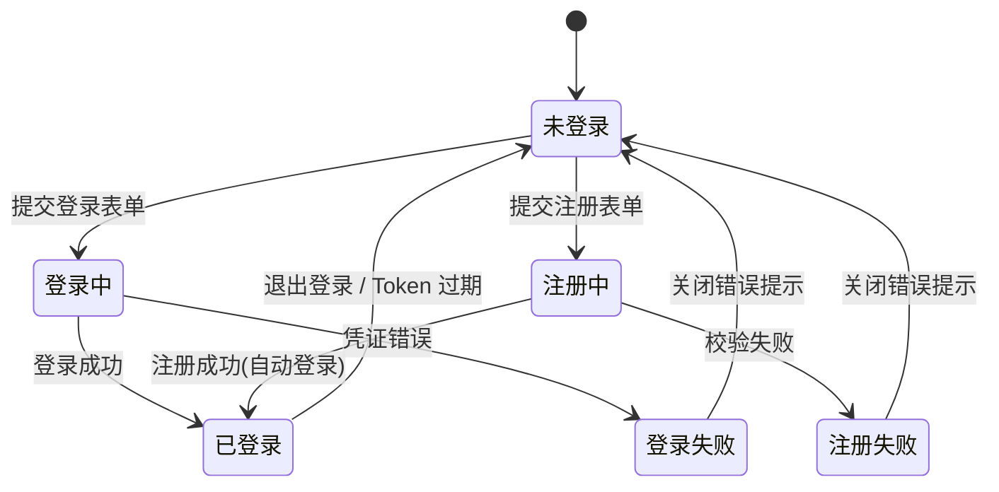
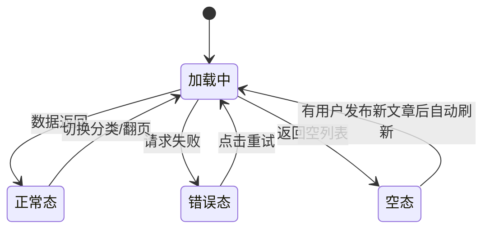
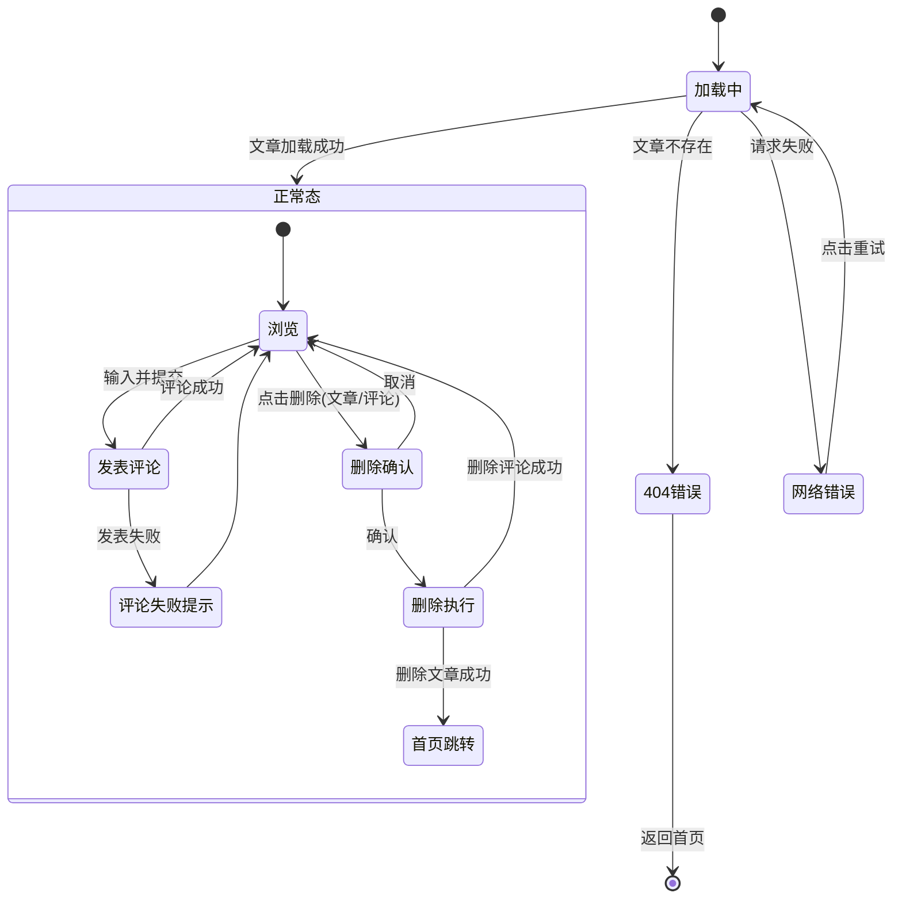
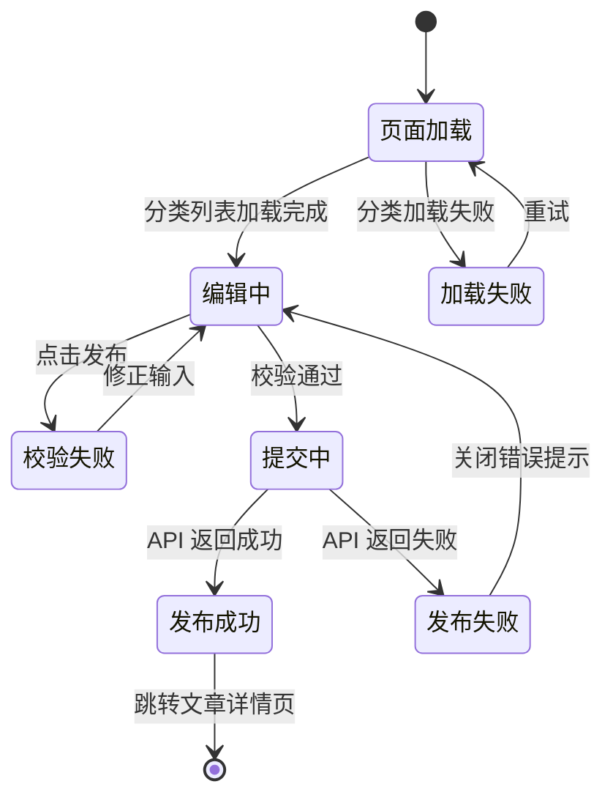

# 多作者博客平台 — 原型说明

## 文档信息

| 字段 | 内容 |
|------|------|
| 项目名称 | 多作者博客平台 |
| 文档类型 | 原型说明 (Prototype Specification) |
| 版本 | v1.0 |
| 创建日期 | 2026-04-27 |

---

## 1. 全局设计

### 1.1 设计约束

- 文章内容为纯文字，不使用富文本编辑器或 Markdown 渲染器
- 两级角色（管理员 / 普通用户），权限判断贯穿全局
- 所有页面需处理三种核心状态：**加载中**、**正常**、**错误/空**

### 1.2 全局组件 — 导航栏 (Navbar)

**位置**：页面顶部，固定定位。
**组成**：
- 左侧：Logo + 站点名称（点击回首页）
- 中间：分类导航链接（技术 / 生活 / 随笔 …），从后端获取分类列表
- 右侧：用户区
  - **未登录态**：显示「登录」「注册」按钮
  - **已登录态（普通用户）**：显示用户名下拉菜单 →「我的文章」「发布文章」「退出登录」
  - **已登录态（管理员）**：同上，增加「管理后台」入口

**交互**：
- 点击分类链接 → 首页按分类筛选
- 点击「发布文章」→ 跳转到发布页（需登录）
- 点击「管理后台」→ 跳转到管理后台首页

### 1.3 全局状态管理



---

## 2. 页面详细说明

### 2.1 首页 — 文章列表 ( `/` )

#### 2.1.1 页面结构

```
┌──────────────────────────────────────────────┐
│  Navbar                                       │
├──────────┬───────────────────────────────────┤
│ 分类侧栏 │  文章列表区                         │
│          │                                   │
│ ▸ 全部   │  ┌─────────────────────────────┐  │
│   技术   │  │ 文章标题                     │  │
│   生活   │  │ 作者 · 2026-04-27 · 技术     │  │
│   随笔   │  │ 摘要文字（正文前200字）...     │  │
│          │  │ 💬 12 条评论                 │  │
│          │  └─────────────────────────────┘  │
│          │  ┌─────────────────────────────┐  │
│          │  │ ...更多文章卡片...            │  │
│          │  └─────────────────────────────┘  │
│          │                                   │
│          │  < 1  2  3 ... 10 >  分页器      │
├──────────┴───────────────────────────────────┤
│  Footer                                       │
└──────────────────────────────────────────────┘
```

#### 2.1.2 核心组件

| 组件 | 说明 |
|------|------|
| CategorySidebar | 分类列表，高亮当前选中分类。「全部」为默认项 |
| ArticleCard | 文章卡片，显示标题、摘要、作者、时间、分类、评论数 |
| Pagination | 分页器，显示页码，支持前后翻页 |

#### 2.1.3 交互流程

1. **页面加载** → 显示加载骨架屏（3 个卡片占位）→ 请求文章列表 API
2. **正常态** → 渲染文章卡片列表 + 分页器
3. **空态** → 显示「暂无文章，成为第一个作者吧！」+ 跳转发布页按钮（需登录）
4. **错误态** → 显示「加载失败，请重试」+ 重试按钮
5. **分类切换** → 重新请求该分类的文章列表，回到第 1 页
6. **分页切换** → 请求对应页数据，页面滚动到顶部

#### 2.1.4 状态流转



---

### 2.2 文章详情页 ( `/article/:id` )

#### 2.2.1 页面结构

```
┌──────────────────────────────────────────────┐
│  Navbar                                       │
├──────────────────────────────────────────────┤
│                                               │
│  文章标题 (H1)                                 │
│  作者头像 用户名 · 2026-04-27 · 分类：技术      │
│  [编辑按钮] [删除按钮] ← 仅作者/管理员可见      │
│                                               │
│  ───────────────────────────────────────────  │
│                                               │
│  正文内容（纯文字，保留换行和段落）               │
│  正文内容第二段...                              │
│  正文内容第三段...                              │
│                                               │
│  ───────────────────────────────────────────  │
│                                               │
│  评论区                                       │
│  ┌─────────────────────────────────────────┐  │
│  │ 评论输入框                                │  │
│  │ [发表评论] 按钮                           │  │
│  └─────────────────────────────────────────┘  │
│                                               │
│  ┌─────────────────────────────────────────┐  │
│  │ 用户A · 2026-04-27 14:30                │  │
│  │ 写得真好，学到了很多！                      │  │
│  │ [删除] ← 仅评论者/作者/管理员可见          │  │
│  └─────────────────────────────────────────┘  │
│  ┌─────────────────────────────────────────┐  │
│  │ 用户B · 2026-04-27 15:10                │  │
│  │ 期待更多类似的内容                         │  │
│  └─────────────────────────────────────────┘  │
│                                               │
│  [加载更多评论]                                │
│                                               │
├──────────────────────────────────────────────┤
│  Footer                                       │
└──────────────────────────────────────────────┘
```

#### 2.2.2 核心组件

| 组件 | 说明 |
|------|------|
| ArticleHeader | 标题、作者信息、发布时间、分类标签、操作按钮 |
| ArticleContent | 纯文字正文，保留段落格式 |
| CommentForm | 评论输入框 + 发表按钮（未登录时显示登录提示） |
| CommentList | 评论列表，每条显示用户、时间、内容、删除按钮 |
| LoadMoreButton | 加载更多评论按钮 |

#### 2.2.3 交互流程

**页面加载**：
1. 请求文章详情 API + 评论列表 API
2. 加载中 → 显示骨架屏
3. 文章不存在（404）→ 显示「文章不存在或已被删除」+ 返回首页链接
4. 正常 → 渲染

**评论交互**：
1. 未登录用户看到评论输入框禁用态 + 「登录后参与评论」提示链接
2. 登录用户输入评论 → 点击「发表评论」→ 按钮 loading → 评论追加到列表顶部
3. 发表失败 → toast 提示错误信息
4. 评论为空 → 显示「暂无评论，抢沙发！」

**删除文章交互**：
1. 点击「删除」→ 弹出确认对话框
2. 确认 → 删除请求 → 成功跳转到首页 + toast「文章已删除」
3. 取消 → 关闭对话框

**删除评论交互**：
1. 点击评论的「删除」→ 弹出确认对话框
2. 确认 → 删除请求 → 评论从列表中移除
3. 取消 → 关闭对话框

#### 2.2.4 状态流转



---

### 2.3 发布文章页 ( `/article/new` )

#### 2.3.1 页面结构

```
┌──────────────────────────────────────────────┐
│  Navbar                                       │
├──────────────────────────────────────────────┤
│                                               │
│  发布新文章                                    │
│                                               │
│  文章标题：__________________________________  │
│  （≤ 100 字）                                  │
│                                               │
│  选择分类：[下拉选择 ▾] 技术/生活/随笔          │
│                                               │
│  文章正文：                                    │
│  ┌─────────────────────────────────────────┐  │
│  │                                         │  │
│  │  (纯文字输入区，textarea)                 │  │
│  │                                         │  │
│  │                                         │  │
│  └─────────────────────────────────────────┘  │
│  （≤ 50000 字）                                │
│                                               │
│  [保存草稿] ← 待确认         [发布文章] 按钮    │
│                                               │
├──────────────────────────────────────────────┤
│  Footer                                       │
└──────────────────────────────────────────────┘
```

#### 2.3.2 核心组件

| 组件 | 说明 |
|------|------|
| TitleInput | 标题输入框，实时字数统计 |
| CategorySelect | 分类下拉选择器，从 API 加载分类列表 |
| ContentTextarea | 正文纯文字输入区，保留换行 |
| SubmitButton | 发布按钮，表单校验通过后可点击 |

#### 2.3.3 表单校验规则

| 字段 | 规则 | 错误提示 |
|------|------|----------|
| 标题 | 必填，≤ 100 字 | 「请输入标题」/「标题不能超过 100 字」 |
| 分类 | 必选 | 「请选择文章分类」 |
| 正文 | 必填，≤ 50000 字 | 「请输入正文内容」/「正文不能超过 50000 字」 |

#### 2.3.4 交互流程

1. **页面加载** → 加载分类列表供下拉选择
2. **用户输入** → 实时字数统计显示（标题：23/100）
3. **表单校验** → 前端即时校验 + 提交前整体校验
4. **提交** → 按钮 loading 态 → API 请求 → 成功跳转到文章详情页 / 失败 toast 提示
5. **取消/返回** → 如已有输入内容，弹出「确认离开？未保存的内容将丢失」

#### 2.3.5 状态流转



---

### 2.4 登录注册

#### 2.4.1 登录页 ( `/login` )

**页面结构**：
```
┌──────────────────────────────────────────────┐
│  Logo + 站点名称                               │
├──────────────────────────────────────────────┤
│                                               │
│           登录                                │
│                                               │
│  用户名/邮箱：________________________________  │
│                                               │
│  密码：______________________________________  │
│                                               │
│  [登录] 按钮                                   │
│                                               │
│  还没有账号？立即注册 →                         │
│                                               │
├──────────────────────────────────────────────┤
│  Footer                                       │
└──────────────────────────────────────────────┘
```

**交互**：
- 表单校验（非空）
- 登录失败：显示错误信息（「用户名或密码错误」/「账号已被封禁」）
- 登录成功：跳转到首页或来源页面
- 连续失败 5 次 → 锁定提示

#### 2.4.2 注册页 ( `/register` )

**页面结构**：
```
┌──────────────────────────────────────────────┐
│  Logo + 站点名称                               │
├──────────────────────────────────────────────┤
│                                               │
│           注册                                │
│                                               │
│  用户名：____________________________________  │
│  （2-20 位，字母/数字/下划线）                   │
│                                               │
│  邮箱：______________________________________  │
│                                               │
│  密码：______________________________________  │
│  （≥ 8 位）                                    │
│                                               │
│  确认密码：___________________________________  │
│                                               │
│  [注册] 按钮                                   │
│                                               │
│  已有账号？立即登录 →                           │
│                                               │
├──────────────────────────────────────────────┤
│  Footer                                       │
└──────────────────────────────────────────────┘
```

**校验规则**：

| 字段 | 规则 |
|------|------|
| 用户名 | 2-20 位，字母/数字/下划线 |
| 邮箱 | 合法邮箱格式 |
| 密码 | ≥ 8 位 |
| 确认密码 | 与密码一致 |

**交互**：
- 实时字段校验
- 用户名唯一性检查（失焦时异步校验）
- 注册成功 → 自动登录 → 跳转首页
- 注册失败 → 显示具体错误原因

---

### 2.5 管理后台

#### 2.5.1 全局布局

```
┌──────────────────────────────────────────────┐
│  Navbar (管理后台标识)                          │
├──────────┬───────────────────────────────────┤
│ 侧边栏    │  内容区域                          │
│          │                                   │
│ ▸ 文章管理 │  表格 / 列表 / 操作区              │
│   评论管理 │                                   │
│   用户管理 │                                   │
│   分类管理 │                                   │
│          │                                   │
│ 返回前台  │                                   │
├──────────┴───────────────────────────────────┤
│  Footer                                       │
└──────────────────────────────────────────────┘
```

#### 2.5.2 文章管理 ( `/admin/articles` )

- 文章列表表格：标题、作者、分类、发布时间、状态
- 操作：查看、编辑、删除
- 支持按分类/作者筛选
- 分页

#### 2.5.3 评论管理 ( `/admin/comments` )

- 评论列表：评论内容（截断）、所属文章、评论者、时间
- 操作：查看上下文、删除
- 分页

#### 2.5.4 用户管理 ( `/admin/users` ) — 待确认 Q-03

- 用户列表：用户名、邮箱、角色、状态、注册时间
- 操作：封禁/解封、删除
- 管理员不可删除自己

#### 2.5.5 分类管理 ( `/admin/categories` ) — 待确认 Q-02

- 分类列表：名称、描述、文章数量
- 操作：新建、编辑、删除（有关联文章时确认提示）

---

### 2.6 编辑文章页 ( `/article/:id/edit` )

与发布文章页结构相同，但：
- 表单预填已有数据
- 标题改为「编辑文章」
- 提交按钮改为「保存修改」
- 增加「取消」按钮回到文章详情

---

## 3. 全局交互规范

### 3.1 三种核心状态

| 状态 | 表现 |
|------|------|
| **加载中** | 骨架屏（灰色占位块，模拟内容布局） |
| **空态** | 居中插画/图标 + 说明文字 + 可选操作按钮 |
| **错误态** | 错误信息 + 「重试」按钮；网络错误提示 toast |

### 3.2 操作反馈

| 操作 | 反馈方式 |
|------|----------|
| 创建成功 | Toast 提示 + 页面跳转 |
| 编辑成功 | Toast 提示「保存成功」 |
| 删除成功 | Toast 提示 + 列表移除/跳转 |
| 操作失败 | Toast 提示错误原因（3 秒自动消失） |
| 危险操作 | 弹出确认对话框（Modal） |

### 3.3 权限控制

- **前端**：根据登录状态和角色，条件渲染按钮/入口
- **后端**：每个需要鉴权的 API 校验 JWT + 角色

### 3.4 路由守卫

| 路由 | 守卫规则 |
|------|----------|
| `/article/new` | 需登录，未登录跳转 `/login` |
| `/article/:id/edit` | 需登录 + 文章作者或管理员 |
| `/admin/*` | 需管理员角色 |
| `/login`, `/register` | 已登录用户访问时重定向到首页 |

---

## 4. 关键组件清单

| 组件名 | 类型 | 复用页面 | 关键 Props |
|--------|------|----------|------------|
| AppNavbar | 全局 | 所有页面 | `user`, `categories` |
| AppFooter | 全局 | 所有页面 | — |
| ArticleCard | 展示 | 首页 | `article` |
| ArticleList | 容器 | 首页 | `categoryId`, `page` |
| CategorySidebar | 导航 | 首页 | `categories`, `activeId` |
| Pagination | 导航 | 首页, 管理后台 | `current`, `total`, `onChange` |
| ArticleForm | 表单 | 发布页, 编辑页 | `initialData?`, `onSubmit` |
| CommentForm | 表单 | 文章详情页 | `articleId`, `onSubmit` |
| CommentList | 展示 | 文章详情页 | `comments`, `onDelete` |
| ConfirmModal | 反馈 | 全局 | `title`, `message`, `onConfirm` |
| Toast | 反馈 | 全局 | `type`, `message`, `duration` |
| Skeleton | 加载 | 全局 | `type` (card/list/detail) |
| EmptyState | 空态 | 全局 | `message`, `action?` |
| ErrorState | 错误态 | 全局 | `message`, `onRetry` |
| LoginForm | 表单 | 登录页 | `onSubmit` |
| RegisterForm | 表单 | 注册页 | `onSubmit` |
| AdminSidebar | 导航 | 管理后台 | `activeMenu` |
| DataTable | 展示 | 管理后台 | `columns`, `data`, `actions` |
